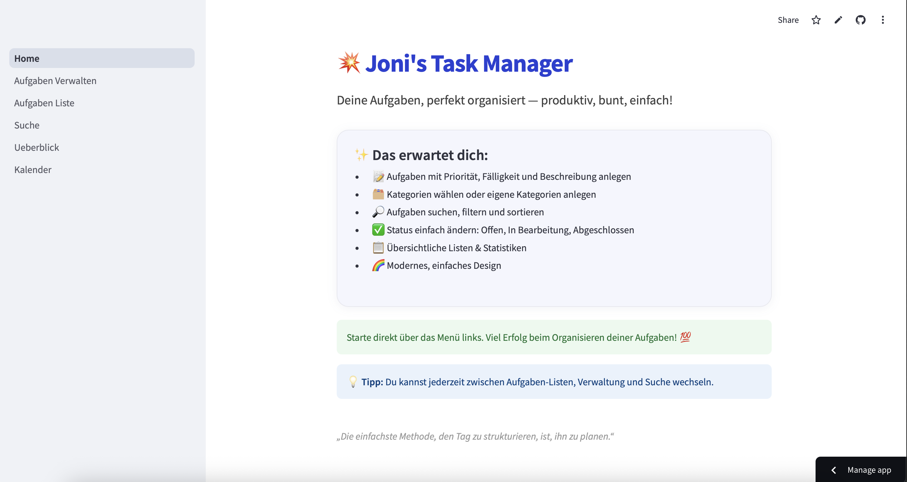
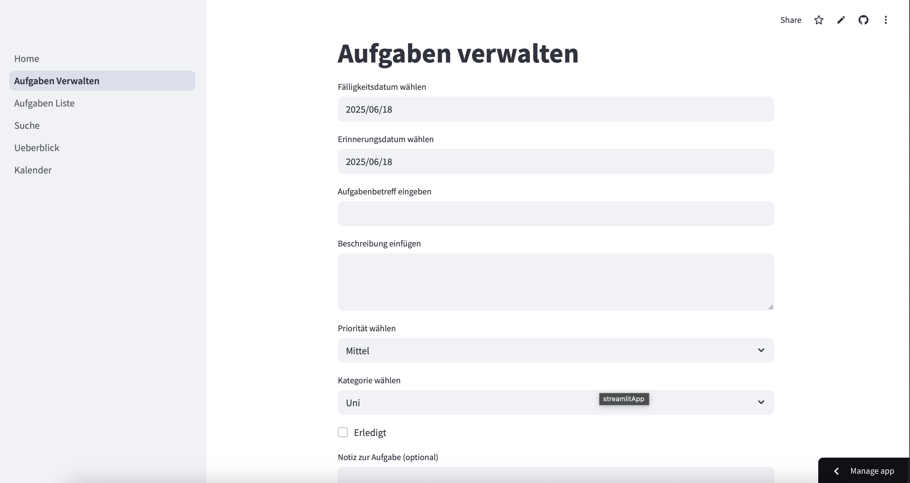
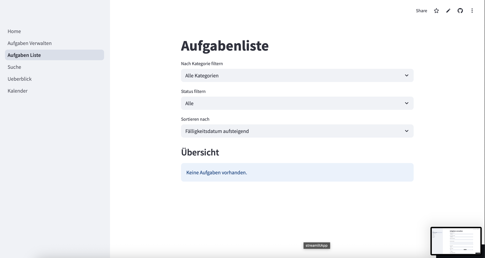
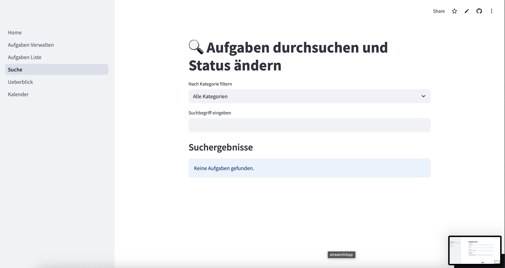
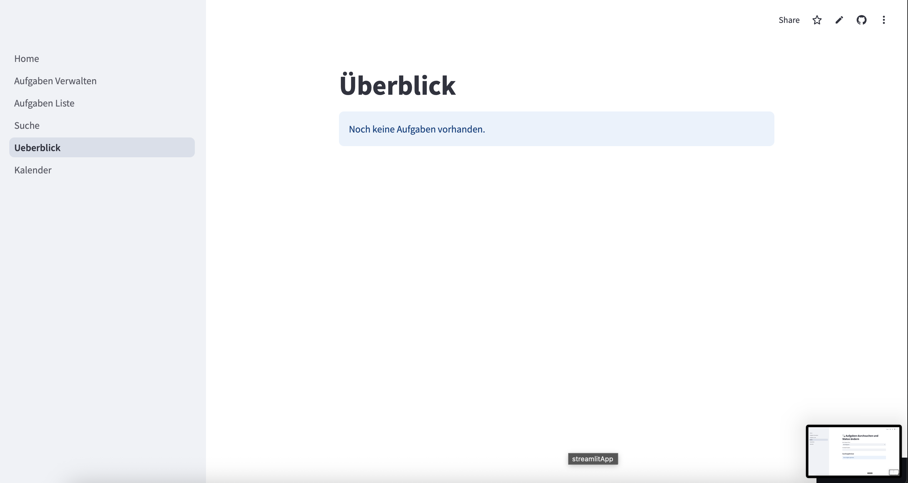
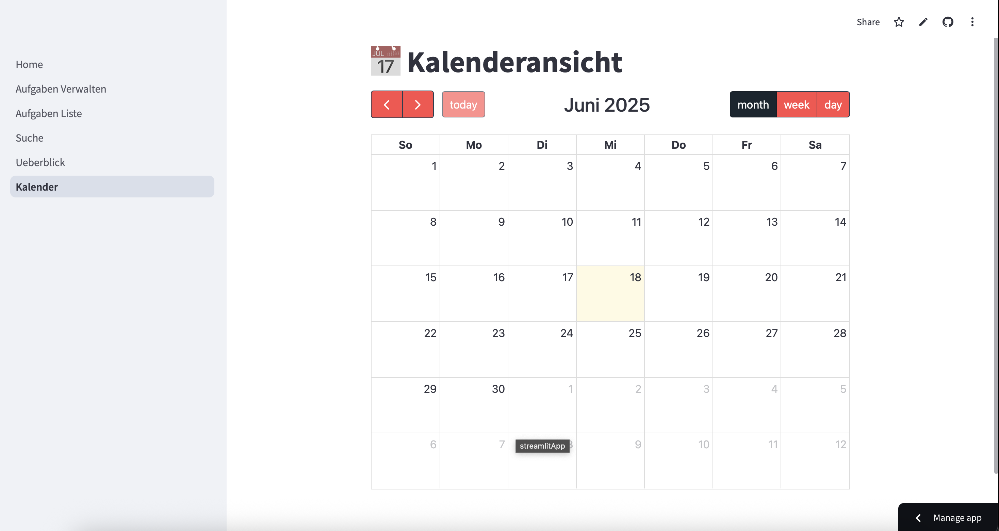

# Aufgabe Projektreport

Bitte reflektiert im Zuge eures Gruppenprojekts folgende Fragen in Bezug auf die entwickelte Task-Manager-App. Dokumentiert eure Überlegungen Am Besten in einem eigenen Markdown-File in eurem Projektrepository.

# Projekt Review 1

* ### Wie hat uns SCRUM bei der Bearbeitung unserer Projektarbeit unterstützt?

SCRUM hat uns geholfen, unsere Arbeit in klar strukturierte Sprints zu unterteilen und den Überblick über Aufgaben, Fortschritt und Verantwortlichkeiten zu behalten. Die Reviews sorgten für regelmäßigen Austausch und Feedback.

* ### Wie hat uns SCRUM bei der Bearbeitung unserer Projektarbeit behindert?

Da wir alle zum ersten mal mit SCRUM gearbeitet haben, war es besonders am Anfang eine Herausforderung damit klar zu kommen.

* ### Wo stehen wir gerade und was haben wir bisher umgesetzt?

Wir haben eine funktionale Basisversion des Task-Managers erstellt: User können Aufgaben anlegen, bearbeiten, löschen die Aufgaben im Kalender einsehen und kleine Dateien im Anhang hinzufügen. 

* ### Wo wollen wir als nächstes hin - welche neuen Features planen wir?

Geplant sind ein Benachrichtigungssystem für Deadlines sowie eine einfache Nutzerverwaltung für Teamprojekte wo man Aufgaben mit anderen Personen teilen kann.

# Projekt Review 2

* ### Was ist in den vergangenen vier Sprints gut gelaufen?

Unsere Sprints in der Uni haben sich als sehr effektiv erwiesen. Da alle Teammitglieder anwesend waren, konnten wir schnell Entscheidungen treffen und effizient arbeiten. Auch das enge Testen und Reflektieren nach jedem Sprint war hilfreich.

* ### Wo stehen wir gerade und was kommt als nächstes?

Wir sind in der Abschlussphase des Projekts. Die Grundfunktionen sind implementiert – als Nächstes geht es um Feinschliff, Tests und eventuell noch kleinere Zusatzfeatures.

* ### Wie hat sich die Komplexität in unserem Projekt verändert und welche Herausforderungen waren damit verbunden?

Zu Beginn wurden nur Tasks erstellt, um einen Rohbau des Task Managers zu schaffen. Nach und Nach wurden immer mehr Features hinzugefügt wie zum Beispiel das Einfügen von Dateien sowie die Kalenderansicht.

* ### Wie gehen wir im Projekt aktuell mit diesen Herausforderungen um?

Wir besprechen größere Änderungen gemeinsam während der Sprint-Treffen in der Uni und wenn es Probleme gibt, finden wir gemeinsam eine Lösung.

# Produkt Review

* ### Welche User-Stories haben wir erfolgreich umgesetzt?

- sreamlit.io vorlage Suchen
- Als Student will ich eine Oberfläche haben, damit ich meine Tasks übersichtlich einsehen kann
- Als Studentin will ich neue Tasks anlegen können um eine neue Aufgabe in meiner ToDo liste zu ergänzen
- Als Nutzer möchte ich Aufgaben priorisieren, damit ich mich zuerst auf die wichtigsten konzentrieren kann
- Als Nutzer möchte ich Aufgaben kategorisieren, damit ich sie nach Thema oder Typ ordnen kann.
- Als Nutzer möchte ich den Status von Aufgaben verfolgen, damit ich weiß, welche Aufgaben in Bearbeitung, abgeschlossen oder noch offen sind.
- Als Nutzer möchte ich eine Suchfunktion verwenden können, um schnell bestimmte Aufgaben oder Kategorien zu finden.
- Als Nutzer möchte ich Aufgaben mit Notizen oder Anhängen (z. B. PDF-Dateien, Links) ergänzen können, damit ich alle relevanten Informationen an einem Ort habe. 
- Bugfix: nachdem ich eine Task eingefügt habe, sollen die Felder, in dem Sachen eingegeben wurden wieder leer sein
- Als Student möchte ich nach der Priorität filtern
- mullti pages hinzufügen: "Home", "Aufgaben verwalten", "Aufgaben Liste", "Suche", "Überblick", "Kalender"

* ### Welche User-Stories mussten wir zurückstellen, oder konnten wir nicht umsetzen?

keine

* ### Wie sieht unsere App am Ende der Projektlaufzeit aus?

* ### Wie gut passt unser Finales Produkt zu der eingangs formulierten Produkt Vision?

Unsere Vision eines schlanken, alltagstauglichen Task-Managers haben wir umgesetzt. Die wichtigsten Grundlagen sowie coole Features sind vorhanden, der Code ist sauber strukturiert, und die Benutzerführung ist intuitiv.
